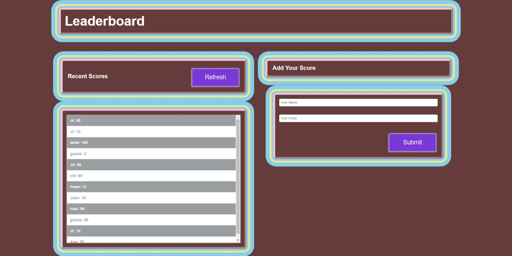

# Leaderboard

The leaderboard website displays scores submitted by different players. It also allows you to submit your score. All data is preserved thanks to the external Leaderboard API service
This is built using ES6 and Webpack!

## Built With 🔨

- JavaScript
- HTML
- CSS
- Webpack
- Visual Studio Code
- Git & Github
## Live Demo
## Getting Started

👤 **Fondem Junior**

 - [Github](https://github.com/Fondem-Jr)
 - [Linkedin](https://www.linkedin.com/in/fondem-junior-57484744/)
 - [Twitter](https://twitter.com/OpportunistZeus)

### Install

To get a local copy up and running follow these simple example steps.
- Open terminal
- Clone this project by the command `git clone git@github.com:Fondem-Jr/Leaderboard.git`
- `cd <clone>` folder
- Run `npm start` in your local browser or using Live Server in Visual Studio Code.

### Prerequisites

- IDE to edit and run the code (We use Visual Studio Code 🔥).
- [Node.js](https://nodejs.org/en/download/) already downloaded.
- Webpack - [click here to getting started](https://webpack.js.org/guides/getting-started/).

### Usage

- Practice Webpack skills.
- Manage files using Webpack.
- Understand how to use medium-fidelity wireframes to create a UI.

## 🤝 Contributing

Contributions, issues, and feature requests are welcome!

## Show your support

Give a ⭐️ if you like this project!

## Acknowledgments

- Hat tip to anyone whose code was used 🔰
- Inspiration 💘
- Microverse program ⚡
- Our standup team 🏹
- Our family's support 🙌

## 📝 License

This project is [MIT](./LICENSE) licensed.
